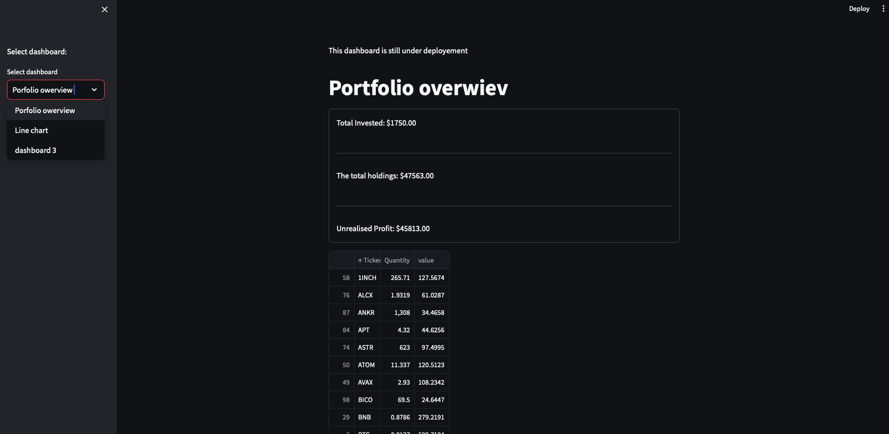
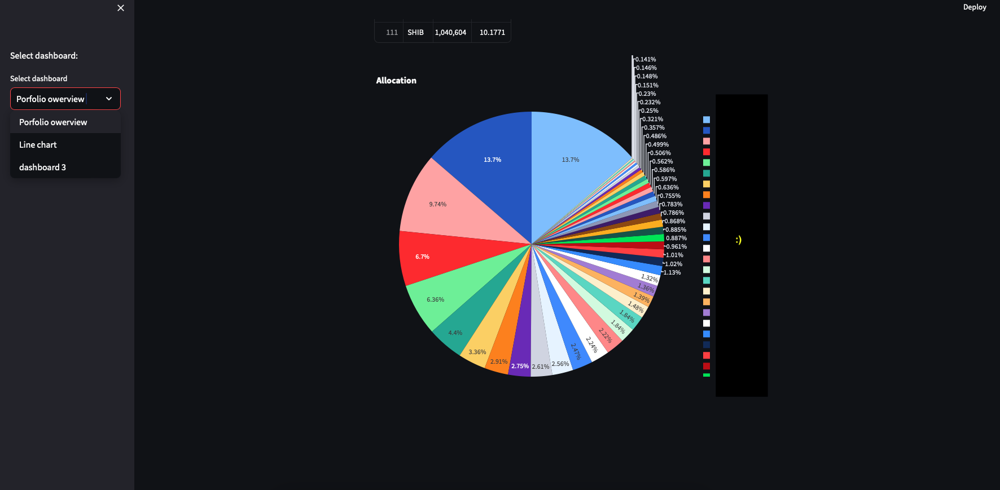
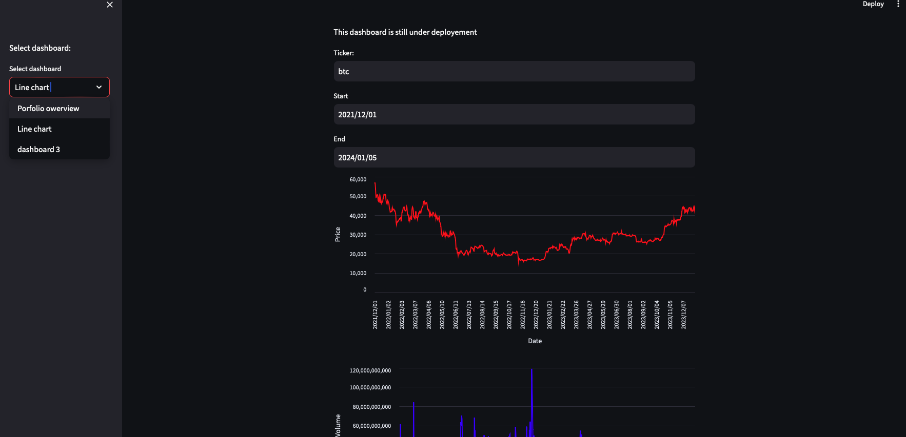

# Represenantion of some data analytics steps.
- Data extraction 
- Data preprocessing 
- Visualisation 

# basic blockchain metrics 
- Correlation between BTC and ETH 
- Distribution of Total Address Count for each coin by Holder Amount
- Network Hashrate and Difficulty
- Coin price and Difficulty
- Active Addresses compared to bitcoin
- Transaction Count compared to Bitcoin 
- Large Transactions ETH vs BTC

# Weather in London 
- Basic tutorial "how to dealing with Apache Spark"

# WebApp based financial Dashboard
- Developing financial dashboard using Streamlit
- to run WebApp: # streamlit run WebApp_Dashboard/Dashboard.py
## WebApp UI
### Dashboard 1 - Portfolio overwiev

### Dashboard 2 - Line charts

