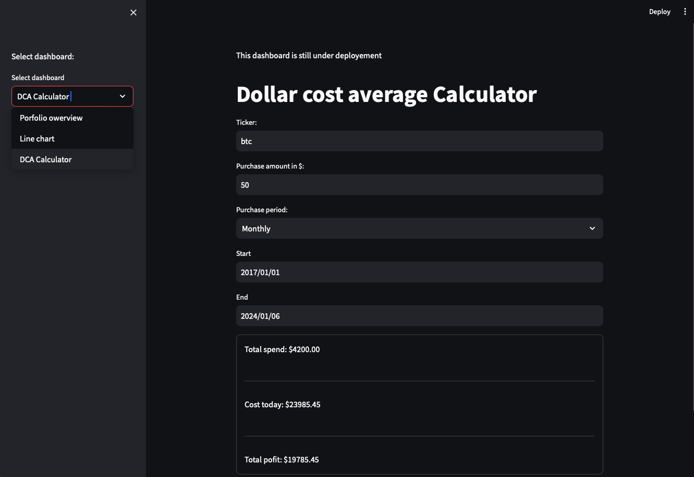

# WebApp-Based Financial Dashboard
- Developing a financial dashboard using the following freamworks:
    - Streamlit
    - Pandas
    - NymPy
    - Plotly
    - SQLite3
    - Requests
    - YAML
- Financial stock data has been loaded through following market aggregation platforms      
    - Cryptocompare
    - Yahoo Finance

- To run the WebApp:  'streamlit run WebApp_Dashboard/Dashboard.py' 
## WebApp - 'Igor' 
### Dashboard 1 - Portfolio overwiev

### Dashboard 2 - Line charts

### Dashboard 3 - DCA Calculator

### Dashboard 4 - SQL Data base

# on_chain - Tutorial 
- How to handle the basics of blockchain metrics
- Correlation between BTC and ETH 
- Distribution of Total Address Count for each coin by Holder Amount
- Network Hashrate and Difficulty
- Coin price and Difficulty
- Active Addresses compared to bitcoin
- Transaction Count compared to Bitcoin 
- Large Transactions ETH vs BTC

# weather_analytics - Tutorial 
- How to dealing with Apache Spark

